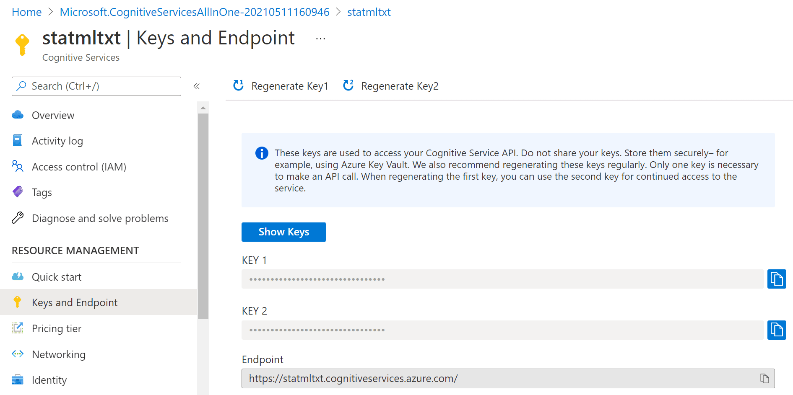

# Azure Paper Exploration Workshop

[](https://mybinder.org/v2/gh/CloudAdvocacy/AzurePaperExplorationWorkshop/HEAD)

In this workshop, we will explore different Microsoft Azure features while working on an important example: extracting some meaningful insights from the collection of COVID-19 papers (so-called [CORD Dataset][CORD]).

> *Overall idea explored in this tutorial has been presented in [this blog post](https://soshnikov.com/science/analyzing-medical-papers-with-azure-and-text-analytics-for-health/)*

We will explore the following features of Azure:
* [Cognitive Services][Cognitive], in particular [Text Analytics for Health][TAH]
* [Cosmos DB][CosmosDB] NoSQL Database
* [Power BI][PowerBI] data visualization tool
* [Optionally] Azure Functions

> To follow this tutorial, you will need an **Azure Subscription**. You can enroll in [Azure Free Trial][AzFree], or [use Azure for Students / Educators][AzStud] if you are a member of an academic institution.

## Our Goal

The goal of our workshop would be to explore the corpus of COVID papers, in order to extract some meaningful insights, for example, changes in treatment strategies over time, or combinations of most used medications.

|  |  |
|----|----|

The main idea is to extract as much semi-structured information from text as possible using [Text Analytics for Health][TAH], and then store it into [Cosmos DB][CosmosDB] for further processing. Storing information in the database would allow us to make some very specific queries to answer some of the questions, as well as to provide visual exploration tool for medical expert for structured search and insight generation.


## Running the Workshop

This workshop is presented in the form of a **Jupyter Notebook**, where you can add your own code and explore. In order to run it, you may use one of the following methods:

* **Locally on your computer** - it requires to have Python installed, with Jupyter kernel. I always recommend starting with [Miniconda][Miniconda], but you can also use [Full Anaconda](https://anaconda.org/) installation. It is also very convenient to use [Visual Studio Code][VSCode] with [Python Extension][VSPy] as code editor, because it supports notebooks natively. For local use, you may clone this repository, install all required packages, and start VS Code in the home directory:
```bash
git clone http://github.com/CloudAdvocacy/AzurePaperExplorationWorkshop
cd AzurePaperExlorationWorkshop
pip install -r requirements.txt
code .
```
* Run on **Data Science Virtual Machine**. You can easily [power up Data Science Virtual Machine][DSVM], which is pre-install with all libraries and running instance of JupyterHub.
* Use **Azure Machine Learning Notebooks** as described [here][AzMLNb]
* Use **[GitHub Codespaces][GHCodeSpaces]** to start the repository right inside GitHub (*Currently, it requires you to sign up for early access*)
* Use **[Binder](http://mybinder.com)** - click on the button below to start your temporary container. **NOTE**: When using binder, the environment will time our periodically, and your work will not be persisted between runs. Thus it is only recommended for taking a quick look at the content.

[](https://mybinder.org/v2/gh/CloudAdvocacy/AzurePaperExplorationWorkshop/HEAD)

Once you have chosen the way to run your notebooks, open [CORDExplore.ipynb](CORDExplore.ipynb) from this repository.
## Getting Paper Abstracts

At the very beginning of COVID pandemic, a [research challenge has been launched on Kaggle](https://www.kaggle.com/allen-institute-for-ai/CORD-19-research-challenge) to analyze scientific papers on the subject. The dataset behind this competition is called [CORD](https://www.semanticscholar.org/cord19) ([publication][CORD-Paper]), and it contains constantly updated corpus of everything that is published on topics related to COVID. Currently, it contains more than 400000 scientific papers, about half of them - with full text.

In our example, we will only analyze a subset of paper abstracts. All paper metadata is available in **Metadata file** [Metadata.csv](https://www.kaggle.com/allen-institute-for-ai/CORD-19-research-challenge?select=metadata.csv). You need to:
1. Download [metadata.csv](https://www.kaggle.com/allen-institute-for-ai/CORD-19-research-challenge?select=metadata.csv) file from Kaggle (you may need to log in / register first)
1. Place it in the current directory and unzip if needed.
1. Run the first few cells in the notebooks to get access to that data using Pandas.
## Using Text Analytics for Health

To analyze abstracts, we will use a cloud service called [Text Analytics][TextAn]. It can do the following:
* **Keyword extraction** and **Named Entity Recognition** (NER) for some common entity types, such as people, organizations, dates/times, etc.
* **Sentiment analysis**
* **Language Detection**
* **Entity Linking**, by automatically adding internet links to some most common entities. This also performs **disambiguation**, for example *Mars* can refer to both the planet or a chocolate bar, and correct link would be used depending on the context.

A special version of [Text Analytics for Health][TAH] exists to provide entities and keywords specific for medical scenarios. Here is an example of what it can do with a piece of text.


> Currently, Text Analytics for Health is available as gated preview, meaning that you need to request access to use it in your specific scenario. This is done according to [Ethical AI][EthicalAI] principles, to avoid irresponsible usage of this service for cases where human health depends on the result of this service. You can request access [here][CSGate].

In order to use [Text Analytics for Health](https://docs.microsoft.com/azure/cognitive-services/text-analytics/how-tos/text-analytics-for-health/?WT.mc_id=stud-27960-dmitryso), you need to obtain endpoint URL and a key. You need to create **Cognitive Services** resource in Azure Portal, and then obtain endpoint URL and access key from there.



To perform analysis, we can use recent version [Text Analytics Python SDK][TAPythonSDK], which we need to pip-install first:
```bash
pip install azure.ai.textanalytics==5.1.0b5
```

> **Note:** We need to specify a version of SDK, because otherwise we can have current non-beta version installed, which lacks Text Analytics for Health functionality. If you have installed all dependencies from `requirements.txt` above, you do not need to do anything, because the correct version of the SDK has been installed as part of the process.

The service can analyze a bunch of **text documents**, up to 10 at a time. You can pass either a list of documents, or dictionary. Provided we have a text of abstract in `txt` variable, we can use the following code to analyze it:
```python
poller = text_analytics_client.begin_analyze_healthcare_entities([txt])
res = list(poller.result())
print(res)
```

This results in the following object:
```txt
[AnalyzeHealthcareEntitiesResultItem(
  id=0, entities=[
     HealthcareEntity(text=2019, category=Time, subcategory=None, length=4, offset=20, confidence_score=0.85, data_sources=None, 
        related_entities={HealthcareEntity(text=coronavirus disease pandemic, category=Diagnosis, subcategory=None, length=28, offset=25, confidence_score=0.98, data_sources=None, related_entities={}): 'TimeOfCondition'}), 
     HealthcareEntity(text=coronavirus disease pandemic, category=Diagnosis, subcategory=None, length=28, offset=25, confidence_score=0.98, data_sources=None, related_entities={}), 
     HealthcareEntity(text=COVID-19, category=Diagnosis, subcategory=None, length=8, offset=55, confidence_score=1.0, 
        data_sources=[HealthcareEntityDataSource(entity_id=C5203670, name=UMLS), HealthcareEntityDataSource(entity_id=U07.1, name=ICD10CM), HealthcareEntityDataSource(entity_id=10084268, name=MDR), ...
```

As you can see, in addition to just the list of entities, we also get the following:
* **Enity Mapping** of entities to standard medical ontologies, such as [UMLS][UMLS].
* **Relations** between entities inside the text, such as `TimeOfCondition`, etc.
* **Negation**, which indicated that an entity was used in negative context, for example *COVID-19 diagnosis did not occur*.

Run section 2 of the Notebook to make sure that entity extraction works.

**TASK**: Run Text Analytics for Health through 100 random abstracts and explore the results:
 
1. See which medications are mentioned most often
1. Build the word cloud of medications and diagnoses (use [this tutorial](https://www.datacamp.com/community/tutorials/wordcloud-python) as a guideline)

## Using REST API to get JSON data

In addition to using Python SDK, you can also call Text Analytics using REST API directly. This is useful if you are using a programming language that does not have a corresponding SDK, or if you prefer to receive Text Analytics result in the JSON format for further storage or processing. In Python, this can be done using `requests` library.

**TASK**: Write a code to analyze 200 random abstracts, and store the result in JSON format for further processing. You may want to store the results in files, or just in memory as Python dicts.

> **Note**: In the next section, we will store the result into the database. If you feel confident, you may go through the next section, and write the combined code to process the abstracts and store the results into the database at the same time.

> **Note**: Processing of all 400k abstracts will require more than 12 hours of continuous work. If we want to do it faster, we may want to parallelize this process using one of the following technologies:
1. Azure Batch - we can spin up a cluster of VMs that will run the same code in parallel to perform the processing
1. Azure Machine Learning cluster - using a **sweep job** with different parameters, we can spin up a cluster of machines that will do parallel processing. It is very similar to Azure Batch, but the code will be simpler, once you know what you are doing. 
1. Azure Functions - we can create a scalable serverless function that will process abstracts from Azure storage queue, and deploy them in a scalable manner.

## Using CosmosDB to Store Analysis Result

It makes sense to store the result of processing in NoSQL database, because inherently the are designed to store and query large collections of JSON documents. We will use Cosmos DB to do this:

1. [Create Cosmos DB database][CreateCDB] on Azure Portal
1. Note the endpoint URL and key
1. Create a collection

Having done that, you should be able to execute the code in the notebook to insert the JSON result from the previous step into the collection.


After running this code, we will end up with the container `Papers` will all metadata. We can now work with this container in Azure Portal by going to **Data Explorer**:


**TASK**: Store the result of processing of 200 random abstracts obtained during the step above into the database.

## Querying data

Now you can write SQL Queries to Cosmos DB in the Query Explorer on Azure Portal. For example, here is how we can obtain the list of all medications found in the corpus:
```sql
-- unique medication names
SELECT DISTINCT e.text 
FROM papers p 
JOIN e IN p.entities 
WHERE e.category='MedicationName'
```

**TASK**: Write queries to do the following:

1. Obtain the data for word cloud for medications (the result should include medication name and number of mentions)
1. Obtain different dosage of hydroxychloroquine mentioned in papers, together with paper and author names

A more difficult task would be to select all entities together with their corresponding ontology ID. This would be extremely useful, because eventually we want to be able to refer to a specific entity (*hydroxychloroquine*) regardless or the way it was mentioned in the paper (for example, *HCQ* also refers to the same medication). We will use UMLS as our main ontology.
```sql
--- get entities with UMLS IDs
SELECT e.category, e.text, 
  ARRAY (SELECT VALUE l.id 
         FROM l IN e.links 
         WHERE l.dataSource='UMLS')[0] AS umls_id 
FROM papers p JOIN e IN p.entities
```
## (Optional) Plot Co-Occurence Diagrams

Using the JSON data above, you can plot the relation diagrams between different terms, similar to the ones below:


To visualize such dependencies, there are two types of diagrams:
* **Sankey diagram** allows us to investigate relations between two types of terms, eg. diagnosis and treatment.
* **Chord diagram** helps to visualize co-occurrence of terms of the same type (eg. which medications are mentioned together)


To plot both diagrams, we need to compute **co-occurrence matrix**, which in the row `i` and column `j` contains number of co-occurrences of terms `i` and `j` in the same abstract (one can notice that this matrix is symmetric). 
To plot the Sankey diagram, we can use [Plotly](https://plotly.com/python/) graphics library. This process is well described [here](https://plotly.com/python/sankey-diagram/). Plotting Chord diagram can be done using [Chord](https://pypi.org/project/chord/) Python library.

## Exploring Data from withing Cosmos DB

In the example above, we could either query data in Cosmos DB, or do the processing in Python. It would be nice to be able to do some Python processing on top of the query result. The most convenient way to do it is to use **Notebooks embedded into Cosmos DB**:


Those notebooks support embedded SQL queries, thus we are able to execute SQL query, and then get the results into Pandas dataframe, which is Python-native way to explore data:
```sql
%%sql --database CORD --container Papers --output meds
SELECT e.text, e.isNegated, p.title, p.publish_time,
       ARRAY (SELECT VALUE l.id FROM l 
              IN e.links 
              WHERE l.dataSource='UMLS')[0] AS umls_id 
FROM papers p 
JOIN e IN p.entities
WHERE e.category = 'MedicationName'
```

**TASK**:
1. Create a notebook in Cosmos DB Data Explorer (on Azure Portal)
1. Make sure you can run the code above to obtain the data frame of all medications and their mentions
1. Try to use Python mechanisms (Pandas) to see how frequency of mentions of different medications change over time, and ideally plot the graphs similar to those shown in the beginning of this tutorial.

## (Optional) Creating Interactive Dashboards

While being able to use SQL query to obtain an answer to some specific question, like medication dosages, seems like a very useful tool - it is not convenient for non-IT professionals, who do not have high level of SQL mastery. To make the collection of metadata accessible to medical professionals, we can use [PowerBI][PowerBI] tool to create an interactive dashboard for entity/relation exploration.


In the example above, you can see a dashboard of different entities. One can select desired entity type on the left (eg. **Medication Name** in our case), and observe all entities of this type on the right, together with their count. You can also see associated UMLS IDs in the table, and from the example above once can notice that several entities can refer to the same ontology ID (*hydroxychloroquine* and *HCQ*).

> **NOTE**: To sign up for Power BI service, you need **corporate e-mail address**, i.e. address provided by some organization, as decribed [here][PBISign]. You will not be able to use free e-mail providers such as outlook.com/gmail. In case you do not have such an address, you can [create Microsoft 365 Trial](https://docs.microsoft.com/power-bi/admin/service-admin-signing-up-for-power-bi-with-a-new-office-365-trial/?WT.mc_id=stud-27960-dmitryso) (even though this is a complex process and is not recommended). 

To make this dashboard:
1. Install and run [PowerBI Desktop][PowerBID].
1. Start the desktop and sign in as described [in this document][PBISign].
1. Import Cosmos DB data - the tools support direct import of data from Azure.
1. Define the data source by providing SQL query to get all entities with the corresponding UMLS IDs - the one we have shown above - and one more query to display all unique categories. 
1. Drag those two tables to the PowerBI canvas to get the dashboard shown above.
 
The tool automatically understands that two tables are linked by one field named **category**, and supports the functionality to filter second table based on the selection in the first one.

## (Optional) Parallelizing Processing with Azure Function

If you want to explore Azure functionality even deeper, it is worth looking into [Azure Functions][AzFunc]. It is a convenient way to execute a piece of code in the cloud when certain event occurs. Processing of abstracts can be organized using Azure Functions in the following manner:
* Create an Azure Function that will react to [queue trigger](https://docs.microsoft.com/azure/azure-functions/functions-create-storage-queue-triggered-function/?WT.mc_id=stud-27960-dmitryso), taking input data (abstract, publication time, etc.) as JSON-encoded queue message, and storing the result of processing into Cosmos DB (using [output binding](https://docs.microsoft.com/azure/azure-functions/functions-bindings-cosmosdb-v2-output?tabs=python&WT.mc_id=stud-27960-dmitryso) to connect to database declaratively).
* Create a Python script that will take 200 random papers, and generate corresponding 200 queue messages for those.

If you configure your function to use [consumption plan](https://docs.microsoft.com/azure/azure-functions/functions-scale/?WT.mc_id=stud-27960-dmitryso) (also called **serverless**), execution should automatically be scaled to handle messages in the effective manner.

## Conclusion

During this workshop, we have learnt how to use several important Azure services: Text Analytics, Cosmos DB, and others. More importantly, we have seen how the cloud help us put together a working solution to a rather complex problem in the matter of hours, building it from existing blocks and platform services.

[Miniconda]: https://docs.conda.io/en/latest/miniconda.html
[CORD]: https://www.semanticscholar.org/cord19
[TAH]: https://docs.microsoft.com/azure/cognitive-services/text-analytics/how-tos/text-analytics-for-health/?WT.mc_id=stud-27960-dmitryso
[Cognitive]: https://azure.microsoft.com/services/cognitive-services/?WT.mc_id=stud-27960-dmitryso
[CosmosDB]: https://azure.microsoft.com/services/cosmos-db/?WT.mc_id=stud-27960-dmitryso
[PowerBI]: https://powerbi.microsoft.com/?WT.mc_id=stud-27960-dmitryso
[CosmosSQL]: https://docs.microsoft.com/azure/cosmos-db/sql-query-getting-started/?WT.mc_id=stud-27960-dmitryso
[AzFree]: https://azure.microsoft.com/free/?WT.mc_id=stud-27960-dmitryso
[AzStud]: https://azure-for-academics.github.io/getting-azure/
[VSCode]: https://code.visualstudio.com/?WT.mc_id=stud-27960-dmitryso
[VSPy]: https://code.visualstudio.com/docs/languages/python?WT.mc_id=stud-27960-dmitryso
[DSVM]: https://docs.microsoft.com/en-us/azure/machine-learning/data-science-virtual-machine/dsvm-ubuntu-intro?WT.mc_id=stud-27960-dmitryso
[GHCodeSpaces]: https://github.com/features/codespaces
[AzMLNb]: https://docs.microsoft.com/azure/machine-learning/how-to-run-jupyter-notebooks/?WT.mc_id=stud-27960-dmitryso
[TextAn]: https://azure.microsoft.com/services/cognitive-services/text-analytics/?WT.mc_id=stud-27960-dmitryso
[CreateCDB]: https://docs.microsoft.com/azure/cosmos-db/create-cosmosdb-resources-portal/?WT.mc_id=stud-27960-dmitryso
[PowerBID]: https://powerbi.microsoft.com/desktop/?WT.mc_id=stud-27960-dmitryso
[AzFunc]: https://docs.microsoft.com/en-us/azure/azure-functions/?WT.mc_id=stud-27960-dmitryso
[PBISign]: https://docs.microsoft.com/power-bi/fundamentals/service-self-service-signup-for-power-bi/?WT.mc_id=stud-27960-dmitryso